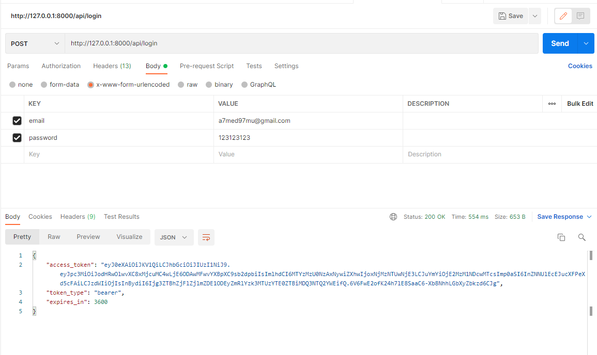

<html>
<body>
Fatura-tech task
Ahmed Muhammed Ahmed 
Email:a7med97mu@gmail.com,
mobile:01154022640 
• The project was built using Laravel framework. 
• Service is responsible for authenticate and login users. 
• Service is responsible for validating whether logged  
user is permitted to do specific action or not. 
• Service is resbonsible for loggin users out from the 
system. 
• secure user's session (session, jwt): 
-Using JWT auth :- follow path  
app/http/controllers/AuthController.php 
• Test APIs in Postman:- 
• Follow Path routes/api.php 
• Test apis in postman 
 
• This access token will be used to make the user  
authenticated 
• I used Repository Design Pattern To make code more 
organized. 
• Follow Path 
app/Repositories/UserRepositoryInterface.php
• Follow Path app/Repositories/UserRepository.php 
• Assign specific user a specific role or permission. 
• Follow Path app/Role.php 
• Follow Path app/User.php 
• getUserRoles() this is relation to get roles of user 
• To see migration file of roles table follow path 
database/migrations/roles.php 
• Jwt documentation =><a href="https://jwt-auth.readthedocs.io/en/develop/laravel-installation/">JWT Documentation</a>  
• Laravel documentation =><a href="https://laravel.com ">Laravel Documentation</a>  
</body>
</html>